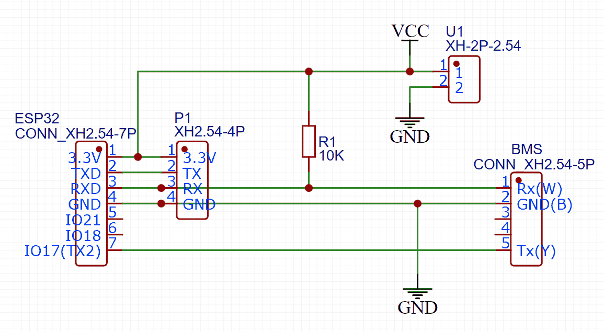
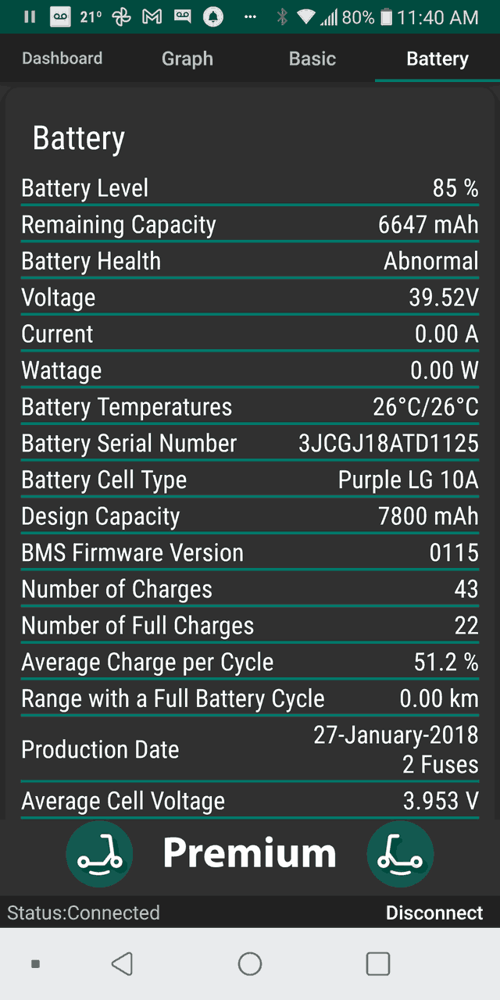
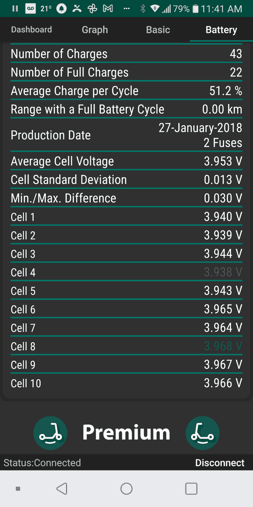
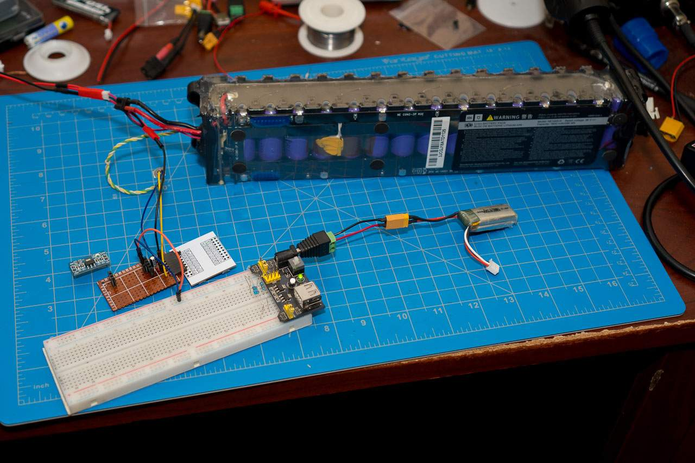
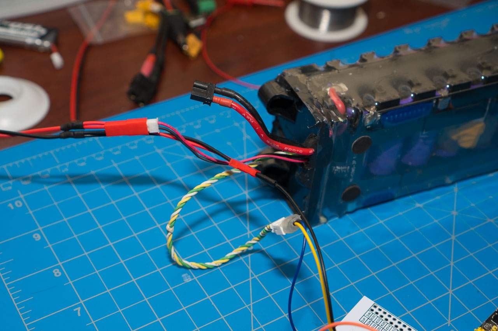
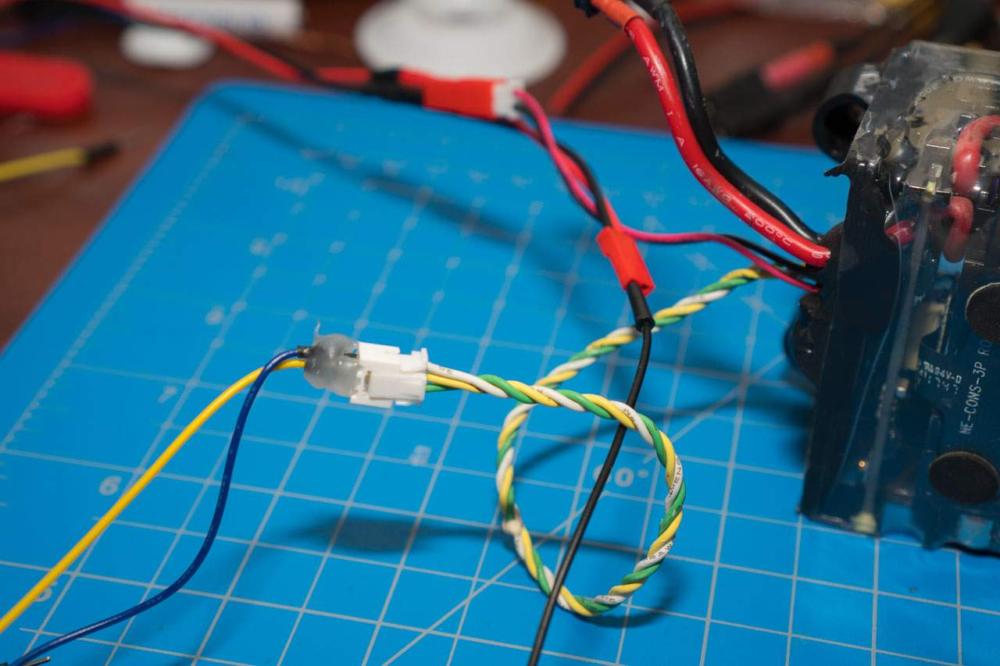
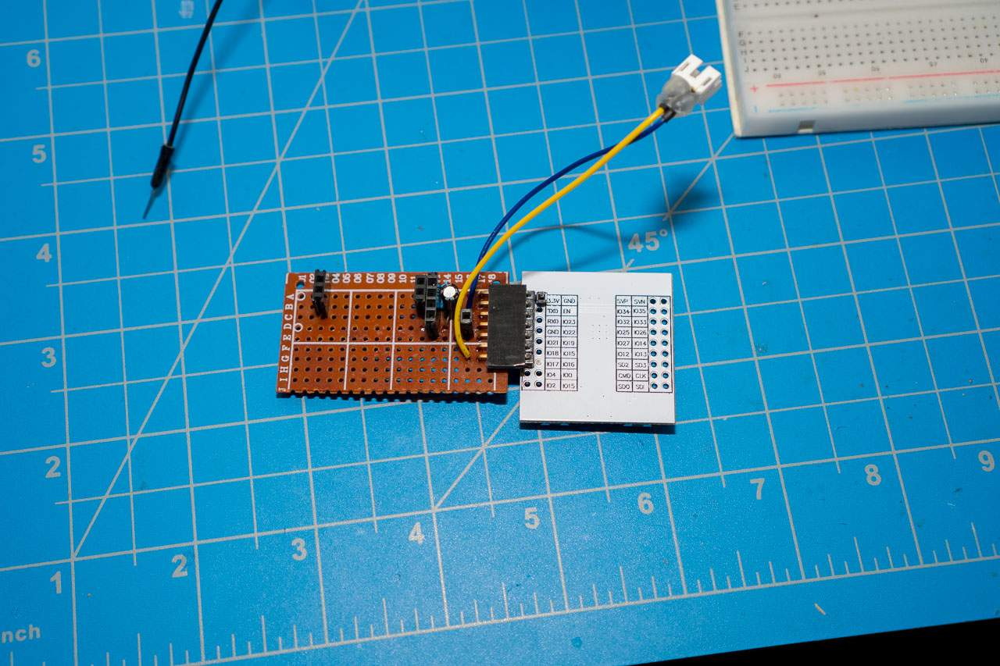
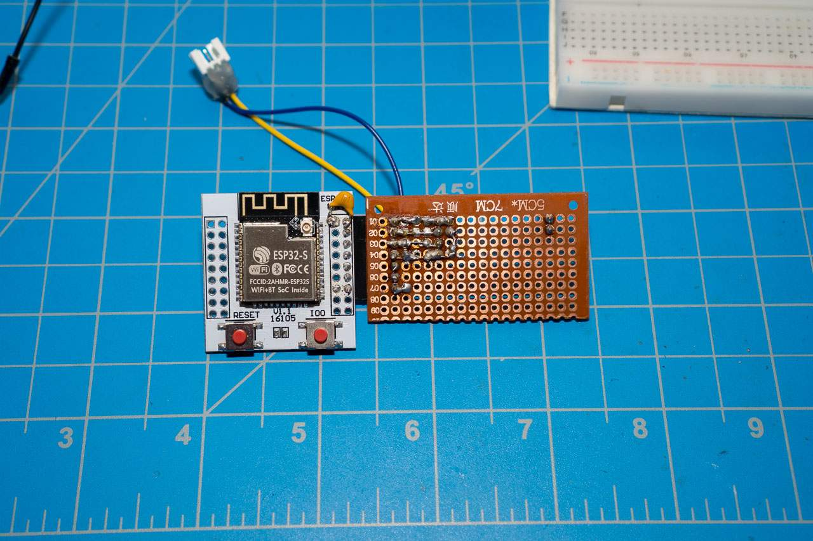

# m365_bms_monitor

Xiaomi M365 BMS Monitor based on ESP32 with BLE support.

## Overview

This project is designed for the use of M365 compatible batteries either in M365 clones without BMS monitoring support or just a standalone power bank. There have been reports that without data communication from ESC battery power gets cut off under heavy load(7-10A) which I didn't test myself since I only tested it on the bench and didn't have the appropriate high power load.

`src/m365_bms_activator.ino` - simple code for activation of the battery only(ignores output from the battery). Work with any kind of Arduino compatible device(UNO, Nano, ESP8266/ESP32).

`src/m365_esp32BLE_emulator.ino` - BLE emulator using ESP32 to test phone app. It does not support BMS connection and has messages hardcoded.

`src/m365_esp32BLE_bmsmonitor.ino` - full BLE emulator using ESP32. Not only it activates the battery but also allows connection M365Tools android app to monitor it's health including individual cell voltages.

**I have tested it with BMS 1.1.5 version which uses 55AA protocol. Newer BMS might use newer 5AA5 protocol so the code will have to be slightly modified. I am too lazy to upgrade and therefore have no way of testing newer BMS.**

## Connection

Data cable from the battery has 3 pins:
- White: RX from point of view ESC/BLE(TX for BMS)
- Blue: GND
- Yellow: TX from point of view ESC/BLE(RX for BMS)

The connector is regular JST PH2.0 which requires to cut space for the notch(see images below).

For activator you only need to connect TX from Arduion/ESP to the corresponding connection on the data pigtail. Obviously you also need to have a common ground.

For full ESP32 fledge monitor you also need to connect RX coming from BMS and have 10K pullup resistor(for some boards it doesn't work without it). I use TX2 here to transmit commands to BMS and reserved regular TX for debuging via serial. But you could just use TX/RX if you don't want debugging.
ESP32 here uses Bluetooth LE to pass the response from BMS to M365Tools monitoring app. It works with old and new M365Tools versions since it converts 55AA to 5AA5 protocol if needed.

Schematics:  P1 header is only for flashing and debuging, I need it since I am using barebone ESP32 module. VCC is regulated 3.3V to power ESP32.

## Reference information

Thanks to the following projects which helped me to understand the protocol: 

https://github.com/CamiAlfa/M365-BLE-PROTOCOL

https://github.com/etransport/ninebot-docs/wiki/protocol

https://github.com/camcamfresh/Xiaomi-M365-BLE-Controller-Replacement

## Bench TEST

If you still have questions hopefully images will clear those out.

M365Tools: 

Bench test: 

